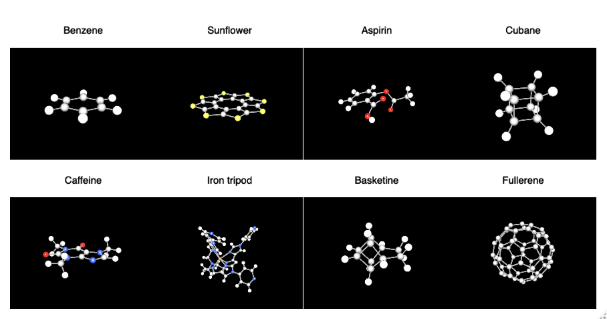

<!-- README.md is generated from README.Rmd. Please edit that file -->

```{r, include = FALSE}
knitr::opts_chunk$set(
  collapse = TRUE,
  comment = "#>",
  out.width = "100%"
)
```

# chemviewR

<!-- badges: start -->

[](https://lifecycle.r-lib.org/articles/stages.html#experimental) [](https://CRAN.R-project.org/package=chemviewR)

<!-- badges: end -->

The goal of chemviewR is to visualise chemical structures.



## Installation

You can install the development version of chemviewR like so:

``` r
if (!require("remotes"))
    install.packages("remotes")

remotes::install_github("selkamand/chemviewR")
```

## Getting Started

See the [manual](selkamand.github.io/chemViewR/articles/manual.html) to get started

